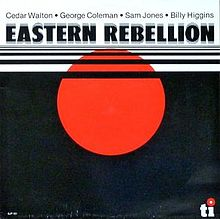

# Billypedia

An intro to jQuery!

Special thanks to Nathan Dooilli @ndonolli for the awesome rename on this project!

---

## Module: jQuery

This project corresponds with the jQuery module of the Operation Spark Bootcamp. See the jQuery module under the Bootcamp in https://greenlight.operationspark.org, and ensure you've read all sub modules therein.

---

### Setup

Run `os install` and select and install the `billypedia` project. Once installed, close any other files you have open in your editor, then, from within the `projects/billypedia` directory, open both the `index.html` and `index.js` pages.  We'll code in these two pages.

Make sure your website is serving from Cloud9, open it, and navigate to your portfolio, select `Billypedia` - this will open the `index.html` page in your browser. You'll see a Wikipedia-like Billypedia page for the great jazz drummer, Billy Higgins.

---

### jQuery

jQuery is a third-party library that allows developers to more easily manipulate the elements of a webpage represented in the <a href="https://en.wikipedia.org/wiki/Document_Object_Model" target="_blank">DOM (Document Object Model).</a>

We're going to use it to modify our Billypedia page, as well to give our page dynamic features.

---

### TODO 1 : Load jQuery

There's several ways to load jQuery into your web project. While package managers are the way to go in production, the easiest is to use a CDN (Content Delivery Network).  Most popular libries are hosted on CDN's, and you only need to Google "library-of-interest CDN" to find a link. Try it with jQuery!

We can link to jQuery using the Google CDN.  Open up the `index.html` file of the Billypedia project, and add the following script tag to the head of the page.

```javascript
<script src="https://ajax.googleapis.com/ajax/libs/jquery/2.2.4/jquery.min.js"></script>
```

#### Test jQuery Setup
If you correctly followed the above setup step for loading jQuery, you can easily test the setup. Go back to your 'index.html' page running in your browser, **refresh the page, open your DevTools console** and type "$", you should see an output similar to this:

```javascript
> $
function (a,b){return new n.fn.init(a,b)}
```

Or:

```javascript
> jQuery
function (a,b){return new n.fn.init(a,b)}
```

If instead you something similar to what's below, then you've yet to included jQuery correctly.

**TODO 1**
```javascript
> $
ReferenceError: $ is not defined
```
---

### TODO 2 : Modify the Page using jQuery

With the DevTools console open, we're going to run some jQuery commands to modify our page. By doing so in the console, we can get jiggy with jQuery without permanently modify the page. The changes we make in these first set of exercises will be reset if you refresh the page, so hold of on refreshing until you finish will all of the steps in **TODO 2**

Making DOM queries with jQuery, we can select elements using CSS selectors. This allows us to select elements by their:

* type: `$('div')`
* class: `$('.heading-quotes')`
* id $('#quotes')

There's also a buttload of options for further targeting elements, like, get the last child of a div, or select only the first `<a>` tag below a `<div>` with class of `blue`.

Let's start with some simple exercises right on our index page.  **In the DevTools console** of your browser running the `index.hml` page of the Billypedia project, run the following commands:

---

#### Select and modify elements

1. Select all divs and change their text color to red:
    
    ```javascript
    $('div').css('color', 'red');
    ```
    
2. Change all the div text color back to black:
    
    ```javascript
    $('div').css('color', 'black');
    ```
    
3. Change the background of the section quotes to grey with rounded corners.
    
    ```javascript
    $('#section-quotes').css('background-color', 'grey').css('border-radius', '4px');
    ```
    
4. Change the color of the quotes heading to white and give it some padding:
    
    ```javascript
    $('.heading-quotes').css('color', 'white').css('padding-left', '10px');
    ```
    
5. Change all the `.quote` class paragraphs to be text color white and font-style of italic:
    
    ```javascript
    $('.quote').css('color', 'white').css('font-style', 'italic');
    ```
    
6. Give the div with id quotes some padding:
    
    ```javascript
    $('#quotes').css('padding-right', '10px').css('padding-left', '10px');
    $('#quotes:last-child').css('padding-bottom', '4px');
    ```
---
    
#### Move, replace, and remove elements

1. Move the section quotes to the top of the div with id sections:
    
    ```javascript
    $('#section-quotes').prependTo('#sections');
    ```
    
2. Change an HTML attribute by swaping out the `src` of the image tag:
    
    ```javascript
    $('#image-billy').attr('src', 'images/billy/billy-1.jpg');
    ```
    
3. Remove the stuff about Billy's divorce!
    
    ```javascript
    $('#section-bio p:last-child').remove();
    ```
---
    
#### Create and add elements

Creating DOM elements with jQuery, we provide a String representing the type of element we want to create. The string must include the element symbols:

```javascript
let $section = $('<section>').attr('id', 'section-rider');
$section.append($('<h3>').text('Billy\'s Rider')).appendTo($('#sections'));
```

Above, when we created the `<section>` element, we've yet to add it to the DOM.  This is optimal because we can build complex, nested elements, and add them once constructed, and this means the webpage is only redrawn once, and not many times per element.

---

### Build out the Billypedia Page

Let's get to work dynamically creating, structuring, styling and adding some elements Billypedia page!

Open up the `index.js` file of the billypedia project, and follow the TODO's below to build out the UI from the loaded JSON data.

---

### TODO 3 : Add Style with jQuery

Style the `$('#section-bio')` and `$('#section-quotes)` as per some of the examples we tried above in the console. These style changes will be permanent, so make Billy proud by styling the page just right!

---

### TODO 4 : Populate the Top Rated List

Populate the `$('#list-top-rated')` unordered list with styled `<li>` containing the details of Billy's top rated recordings. The data is available to you at `data.discography.topRated`.

We've included an example of looping over the list and logging the `recording` so you can see the data structure of a single recording.  The code looks this this:

```javascript
let topRated = data.discography.topRated;
_.forEach(topRated, function(recording) {
    console.log(recording);
});
```

The above code serves to exemplify plucking out the top rated data you need to loop over it. Notice we have the fantastic <a href="https://lodash.com/docs" target="_blank">lodash library</a> in our scope. You'll want to delete this code, and write your own implementation to create all the necessary `<li>`, then append them to the existing top rated unordered list, at `$('#list-top-rated')`.

How can you use `_.map()` to your advantage here?

---

### TODO 5 : Populate the General Recordings List
 
For this **TODO**, you must assemble a new `<section>` and `<ul>` for Billy's general recordings data. Unlike **TODO 4**, there is yet a section or unordered list in the DOM for the recordings, so you must use jQuery to create those elements, too.

a. Create a recordings `<section id="section-recordings">` and add it below the section for top rated recordings in the sidebar. How can you acheive this with jQuery?

b. Create a `<ul id="list-recordings">`, style it, and add it to the `<section id="section-recordings">`.

c. Add a styled `<li class="recording">` for every recording in the recordings Array. What lodash methods can help you here?

d. Add CSS styling rules to the `css/site.css` file to style the list items. Can these style rules apply to list items in both the top rated and recordings lists? How can you acheive this with CSS selectors/rules and jQuery?

**The resulting HTML should look something like this:**

```html
<section id="section-recordings">
  <ul id="list-recordings">
      <li class="recording">
          <div class="title">Title: Eastern Rebellion</div>
          <div class="artist">Artist: Cedar Walton</div>
          <div class="release">Release: Timeless</div>
          <div class="year">Year: 1976</div>
      </li>
      <!-- more list items here -->
  </ul>
</section>
```

---

### TODO 6 : Create Images for Recording Lists

Use jQuery to add an image to the top of the sections for top rated and recordings. By default, show the image that corresponds to the first recording in each list.  

**The resulting HTML should look something like this:**

```html
<div id="image-container-recording" class="image-container">
    
</div>
```

---

### TODO 7 : Dynamically Swap Billy Images

Build out a feature for the image of Billy such that when the user clicks on his picture, we swap out the source of the image to the next available image in the list of Billy images at `data.images.billy`.

How do you add a click handler to an HTML element? How to you change an attribute of an HTML element?

In order to make the HTML layout stay in place when swapping out images, you may need to set `min-width` and `min-height` CSS rules for the image-containing div. How can you do this with a CSS class and style rule?

Can you make the image fade-in?

**BONUS**

You also have available to you a preloader, called a pacifier.  See if you can place one on the image containing div while the picture is loading.  Here's an example of usage:

```javascript
// adds spinner to a native element, note [0] after the jQuery call! //
const pacifier = opspark.makePacifier($('#image-container-billy')[0]);

// stop the pacifier and remove it from the DOM //
pacifier.stop(); 
```

---

### TODO 8 : Dynamically Swap Recording Images 

Build out a feature for the list items of both the top rated and recordings lists such that when the user clicks on one of the `<li>`, we swap out the source of the image for the feature based on the `art` url associated with the recording.

To do this, you need a way of writing some data to each `<li>` such that when a user clicks on it, we can retrieve the data.  How can you do this?

---

### TODO 9 Build a Table using jQuery

Tables are designed for tabular data, and not layout!. For **TODO 8**, you want to build a table using jQuery to list Billy's rider. A rider is all the things a musicians needs to perform, sometimes including smarties with the blue ones removed!

Below is an example of a function that uses jQuery to build a HTML table, based on some people data. Your job is do to something similar with Billy's rider data.

```javascript
var createTable = function(people){
    var createRow = function(person){
        var $row = $("<tr>");
        var $nameFirst = $("<td>").text(person.nameFirst);
        var $nameLast = $("<td>").text(person.nameLast);
        $row.append($nameFirst);
        $row.append($nameLast);
        return $row;
    }
    var $table = $("<table>");
    var $rows = people.map(createRow);
    $table.append($rows);
    return $table;
};
let people = [{nameFirst: "John", nameLast: "Doe"}, {nameFirst: "Dick", nameLast: "Jones"}]
createTable(people).appendTo("body");
```
